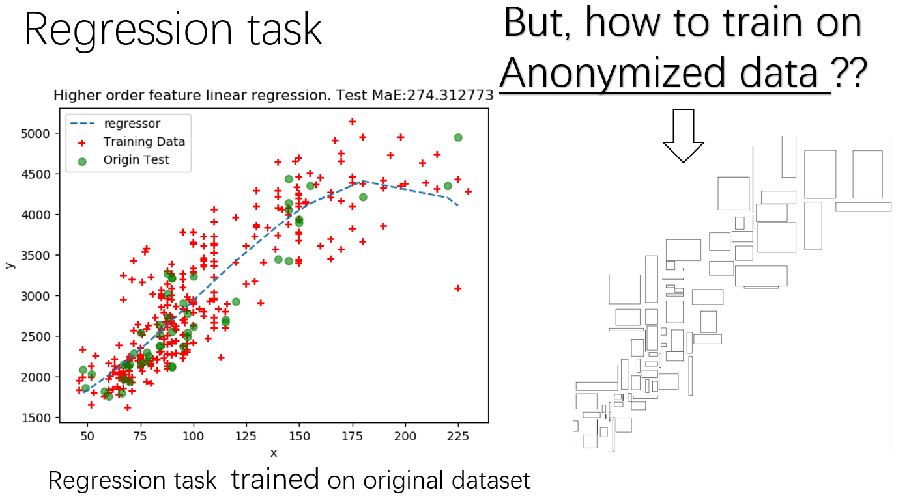

# UHRP
It's the implementation for UHRP: Uncertainty-Based Pruning Method for Anonymized Data Linear Regression.

## Abstract
Anonymization method, as a kind of privacy protection technology for data publishing, has been heavily researched during the past twenty years. However, fewer researches have been conducted on making better use of the anonymized data for data mining. In this paper, we focus on training regression model using anonymized data and predicting on original samples using the trained model. Anonymized training instances are generally considered as hyper-rectangles, which is different from most machine learning tasks. We propose several hyper-rectangle vectorization methods that are compatible with both anonymized data and original data for model training. Anonymization brings additional uncertainty. To address this issue, we propose an Uncertainty-based Hyper-Rectangle Pruning method (UHRP) to reduce the disturbance introduced by anonymized data. In this method, we prune hyper-rectangle by its global uncertainty which is calculated from all uncertain attributes. Experiments show that a linear regressor trained on anonymized data could be expected to do as well as the model trained with original data under specific conditions. Experimental results also prove that our pruning method could further improve the model’s performance.

## Cite paper
Cite this paper as:
Liu K., Liu W., Cheng J., Lu X. (2019) UHRP: Uncertainty-Based Pruning Method for Anonymized Data Linear Regression. In: Li G., Yang J., Gama J., Natwichai J., Tong Y. (eds) Database Systems for Advanced Applications. DASFAA 2019. Lecture Notes in Computer Science, vol 11448. Springer, Cham

DOI: https://doi.org/10.1007/978-3-030-18590-9_2
